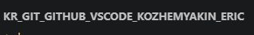
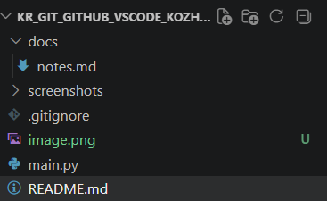
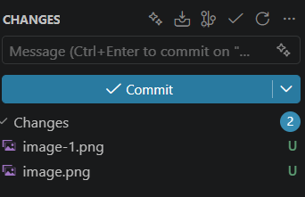
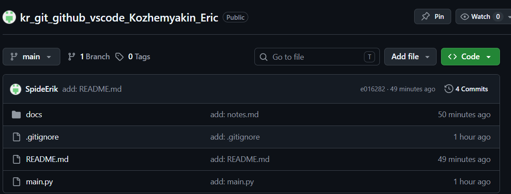
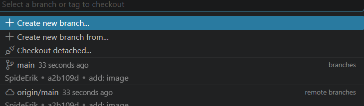

# Git practice: Кожемякин Эрик
## Информация о студенте

| Поле            | Значение                                   |
|-----------------|--------------------------------------------|
| ФИО             | Кожемякин Эрик                              |
| Группа          | РПО/1                          |
| Дисциплина      | Git и GitHub                               |
| Дата выполнения | 17.06.2026                                 |
| Ссылка на GitHub| https://github.com/SpideErik/kr_git_github_vscode_Kozhemyakin_Eric    |

## Цель работы

Закрепить полный цикл работы с Git и GitHub через графический интерфейс VS Code.

## Выполненные этапы

1. Клонировал шаблон проекта из GitHub.
2. Проверил/инициализировал Git-репозиторий.
3. Создал файлы README.md, .gitignore, main.py, docs/notes.md.
4. Настроил .gitignore (.env, venv/, __pycache__/, *.log не попадают в Git).
5. Сделал несколько осмысленных коммитов через Source Control.
6. Опубликовал репозиторий на GitHub через Publish Branch.
7. Создал ветку feature/readme-update.
8. Внёс изменения в ветке и сделал коммит.
9. Слил ветку в main через Merge.
10. Выполнил Fetch и Pull, увидел разницу.
11. Создал и разрешил конфликт в README.md.
12. Оформил README.md как отчёт со скриншотами.

## Что я понял(а) про .gitignore

- `.gitignore` помогает не отправлять в GitHub временные и секретные файлы.
- Файл `.env` нельзя публиковать, потому что в нём могут быть токены и пароли.
- Логи `*.log` обычно не нужны в репозитории.
- Папки `venv/` и `.venv/` не добавляют в Git, потому что их можно создать заново.
- Перед коммитом нужно проверять Source Control.

## Использованные Git-действия

- Clone Repository
- Initialize Repository
- Stage Changes
- Commit
- Publish Branch
- Push / Sync Changes
- Fetch
- Pull
- Create Branch / Switch Branch
- Merge
- Resolve Conflict
- Git Graph

## Скриншоты
1. Созданный репозиторий

2. Инициализированный репозиторий

3. Первый коммит

4. Репозиторий на github

5. Созданная ветка

7. Выполнение Fetch / Pull
[07]([alt text](screenshots/image-5.png)
8. Итоговая система Git Graph
[08]([alt text](screenshots/image-6.png)

## Разница между Fetch и Pull
Fetch проверяет и загружает информацию о новых коммитах из GitHub, но не меняет мои рабочие файлы. Pull загружает изменения и сразу применяет их к текущей ветке. 

## Разрешение конфликта
update status conflict solved
